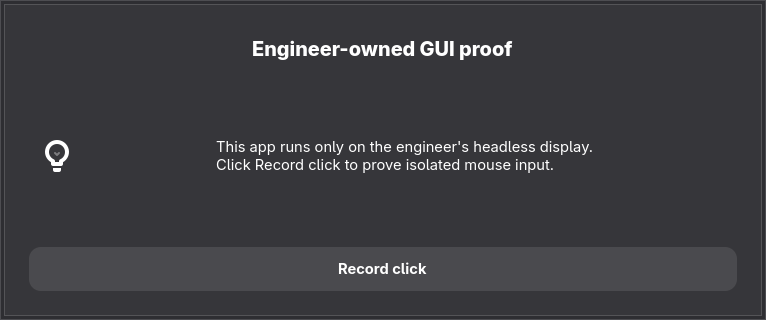

# Native desktop memory guard (US-043)

## Rolling OMP engineer containment — active path

The approved rollout does not move or restart Herdr. New OMP launches use the
stable `~/.local/bin/omp -> omp-engineer` entrypoint; the retained native ELF is
`~/.local/lib/omp-engineer/omp`. Native Herdr discovery, session hooks, Glass
visibility and literal `omp --resume=...` reconstruction remain unchanged.

```text
user@UID.service
├── app.slice                         unchanged desktop, Herdr and old engineers
├── omp.slice                         unlimited memory, zero-swap, ungrouped OOM
│   ├── omp-engineer-<nonce>.scope     4 GiB, zero swap, group-OOM kill
│   ├── omp-engineer-<nonce>.scope     another engineer owner
│   └── omp-engineer-<nonce>.scope     Chromium helper, independent 4-GiB/group-OOM leaf
└── dev.slice/dev-exec.slice           separately owned heavy-job budget
```

Interactive-engineer startup serializes containment inspection through
authenticated, verified scope registration. Each populated cage keeps its
independent 4-GiB bound even when idle or the native root exits but helpers remain.
Only actual cgroup controls, own membership and live oomd monitoring are mandatory.
There is no process-wide `/proc` walk, ancestry/RSS/PSS/smaps inspection,
`legacy.json` or heavy-job inventory in this path. Existing uncaged processes
remain untouched and unbounded until natural exit.

Memory capacity is advisory, per Phaedrus's decision: below the 20-GiB available
memory guideline or above the measured 36-GiB fleet guideline, warn and launch
anyway. Missing `MemAvailable` also warns rather than denying startup.
Warnings appear on stderr and in native memory inspection, never as Glass board
items. A warning changes neither admission nor containment; it creates no backlog
work. Potential full-leaf capacity is not a reservation or warning.
The owned parent has `MemoryMax=infinity`; actual per-engineer 4-GiB, zero-swap,
group-OOM controls and live oomd exclusion remain mandatory containment.
Explicit `engineer-cage` refresh raises an existing populated parent in place
through `systemctl --user set-property --runtime omp.slice MemoryMax=infinity`,
without restarting a slice, Herdr or an engineer, or moving any existing PID.

Native print (`-p`/`--print`), every explicit `--mode`, help/version/export/profile
alias creation, registered management roots and aliases, and stdin pipes/cron run
directly in their caller's cgroup. Root dispatch honors leading flag values and
`--`; print-looking prompt data cannot evade interactive containment. This
classification follows native OMP semantics, not named-caller exemptions.
Display containment is independent: model/tool-capable invocations, including
print, RPC/ACP and piped engineers, now receive the
[live-display namespace boundary](../omp-config/README.md#engineer-display-isolation).
Their unchanged caller cgroup is not permission to access the host screen.

From the reviewed harness revision:

First deploy the reviewed Workbench `host-update` item, when installed, and
require `workbench-host-update omp-install-layouts` to advertise
`harness-engineer-cage-v1`. The explicit activation preflight refuses an old,
malformed or incompatible installed consumer before entrypoint/live-unit writes.
This closes MIS-203's source-compatible-but-not-deployed updater mismatch.

```sh
OMP_INSTALL_COMPONENTS=cli ./omp-config/install           # stage only
OMP_INSTALL_COMPONENTS=engineer-cage ./omp-config/install # explicit activation
omp-engineer memory --json                               # live, no reservation
omp --version                                           # native administrative execution
```

Default installation and `cli` staging leave live units and the stable entrypoint
unchanged; they never activate a previously uncaged host. Explicit activation
validates owned launchers, retains the native ELF, installs the canonical
unlimited `omp.slice` source unit, reloads the user manager and starts the slice
if needed. It then applies
`systemctl --user set-property --runtime omp.slice MemoryMax=infinity` before
read-only memory inspection and replacement of the stable entrypoint.

The same explicit `engineer-cage` command refreshes an already active 36-GiB
parent in place, including when populated. `start` does not restart an active
slice, and `set-property` raises only its live memory cap; existing engineer
scopes and their 4-GiB/zero-swap/group-OOM controls stay unchanged. The canonical
source unit persists infinity across reboot; the runtime property is convergence,
not a separate policy. Do not stop/restart the slice or move PIDs to migrate it.
Activation does not restart Herdr, change oomd or kill engineers. Work continues
in existing sessions; their next natural direct/new/continued/resumed launch
enters the cage. Do not force migration by restarting them.

Memory warnings never cause wrapper exit 75 or roster exit 6. Inspection/setup
and containment failures remain errors; failed native readiness still fails.
Read-only fixture inputs cannot override actual launch or leaf controls. Nested
OMP/helpers inherit the verified existing leaf rather than escaping it.

Keep the retained ELF directory out of ordinary PATH. Native OMP 18.4.9 updates
resolve the target through `which("omp")`; only a mutating `omp update` child
receives that directory first in PATH, protecting the stable wrapper. Read-only
`update --check` retains ordinary PATH. The Workbench updater accepts the exact
owned wrapper/retained-ELF layout and invokes the stable native entrypoint.
Binary/catalog changes still take effect in engineers only on natural relaunch.

On a killed native child (exit 137), the outer wrapper survives outside the
leaf. While it still owns the foreground terminal, it flushes queued input,
restores canonical/echo/signal modes, resets terminal UI modes and flushes late
responses before returning 137 to the shell. It never resets a terminal owned
by a different foreground job. Relaunch the exact saved session using native
Herdr `agent start ... -- omp-arguments` or `omp --resume=<path>`; do not replay a
pending allocator/tool call or paste raw terminal-query responses into the shell.

Observed rollout proof (OMP 18.4.9 / Herdr 0.9.1): native fresh and exact-session
resumed engineers were discoverable in Herdr and Glass and executed real Bash
inside verified 4-GiB/zero-swap/group-OOM scopes. After queued terminal-response
bytes and SIGKILL of only a completed owned probe, the shell reported 137 with
canonical/echo/signals restored; same-pane resume and another real Bash command
succeeded without manual PTY repair. The initial conservative policy refused
real `omp --version` at 47.7 GB available versus 50.6 GB required, with no new
scope. That policy blocked real work and was superseded by the 20-GiB floor:
the recalibrated source admitted actual native OMP at 51.7 GB available with 21.5 GB required.
That hard-refusal policy is superseded by advisory guidance: boundaries warn
without preventing overlay, record or native startup. No physical exhaustion
was used, and boundary fixtures cannot override real launches.
The original Herdr server/client and Hyprland PID/start/cgroup identities stayed
unchanged; surviving original engineers were not moved. Raw transcripts and
process inventory remain private.

The intermediate 20-GiB-floor policy still imposed a 36-GiB fleet cap and
full-cage reservations, blocking additional engineers despite about 46 GiB
`MemAvailable`. Reviewed PR196 deployed advisory guidance at 17:29 CDT on
2026-10-01 without restarting consumers. Two fresh native launches reached
readiness at 17:30 with distinct 4-GiB/zero-swap/group-OOM leaves and visible
Glass warnings. Surviving baseline process start times and cgroups were unchanged.

This is resource containment, not a same-user security boundary. External
daemons and deliberate cgroup escape need independent limits. Keep the approved
wrapper in every ordinary launch path; do not invoke the retained ELF directly.
Rollback requires the prior reviewed launcher/unit contract and reconciliation
with its updater, after owned cages naturally finish. Never stop a populated
shared slice or remove the memory helper while roster callers still require it.

### Chromium helper boundary — K-20261007 increment

The native 18.8.6 browser broker honors `PUPPETEER_EXECUTABLE_PATH`, but re-execs
the retained ELF itself. New caged launches use that supported Chromium hook;
the broker stays in the owner leaf. `omp-browser-helper` connects to one
read-only-mounted private socket and blocks before exec. The host-side display
controller accepts only the installed shim in this owner's private namespaces
and original leaf. The kernel supplies an immutable `SO_PEERPIDFD`; systemd
receives `PIDFDs`, never a reusable numeric PID.

Registration is serialized with existing launch inspection. The controller
checks actual sibling placement, effective controls, systemd registration,
ancestors and oomd exclusion before replying. The shim independently checks
that it left its original leaf and that its new controls match. A denied,
cancelled, malformed or unavailable handoff executes no browser. Exec preserves
native PID/process-group/stdio cancellation and inherited namespace lifetime;
Chromium descendants allocate in the helper leaf. The tiny launch shim's
pre-handoff allocations remain charged to the owner; existing allocations are
not retroactively moved.

Both scopes reuse the existing 4-GiB/zero-swap/group-OOM policy. Owner limits,
running scopes and `omp.slice` are not changed. **Combined owner/helper capacity
can exceed 4 GiB; there is no hard aggregate budget or desktop-floor guarantee.**
The helper uses the existing nonce/unit namespace with a Chromium/owner
description, so the shipped OOM sweep continues recording role/root-fate
unknown instead of inventing an owner loss. Root-lost detection is unchanged.

CLI staging compiles the shim from source and affects future natural starts
only. This workstation's ordinary browser target is `/usr/bin/chromium`; an
explicit executable override remains the target behind the shim. Dedicated
`app.path` browsers are not intercepted. Broker+Chromium, ML and JS-eval
isolation require separate native spawn seams; JS eval's in-process startup
fallback must be eliminated or bounded before claiming its fault isolation.
Activation and CLI updates to an activated cage require `/usr/bin/chromium`;
native browser discovery/auto-download is not this workstation route.
The private `~/.omp/run` mount is disk-backed
and removed with the namespace. Profiles and cache must not remain charged
tmpfs after a helper scope empties and the next launch gets a fresh bound.

Verification must include a real native browser opening/closing and a cancelled
browser operation, actual sibling process/control readback, then a controlled
OOM in **only a disposable helper** with the same engineer root PID/start token
surviving and executing another tool. Record the retained manager OOM event,
not exit 137. Never lower a working helper's limit or run a heavy drill while
host memory is below the advisory floor. Unit/gate checks do not prove this
host journey. Use `OMP_INSTALL_COMPONENTS=cli`, not `engineer-cage`, for the
post-merge install: the latter converges a live parent property and is outside
this increment. Read back installed bytes and a new native launch separately.


## Optional whole-Herdr boundary — separate disruptive cutover

The following pre-existing `desktop-guard` service path is not this rolling
rollout and is not activated by `engineer-cage`. It requires a separately chosen
interruption; never use its server-stop steps to migrate working engineers.

Herdr remains the unmodified upstream binary. A systemd **user** service owns the
server before it creates any pane. New shells, explicit-command panes and native
agent restoration inherit that service's cgroup. The terminal is only a client.
No extension loading or shell-command classification owns this boundary.

```text
user@UID.service
├── app.slice                         desktop applications and terminal clients
└── dev.slice                         aggregate development ceiling
    ├── dev-fleet.slice
    │   └── herdr@SESSION.service     server and all inherited pane processes
    └── dev-exec.slice
        ├── dev-job-1.scope           first admitted local heavy job
        └── dev-job-2.scope           second admitted local heavy job
```

The unit sources in `agent-config/desktop-guard/units/` own the budgets. The
fleet budget is 36 GiB, not the initial brief's 40: 36 + 16 fits the 52 GiB
parent ceiling without deliberately making the fleet and job budgets compete
at the parent. Swap budgets likewise sum to the parent's limit. This is a
maximum, not a desktop memory reservation. Fleet and aggregate `MemoryHigh`
are unlimited; individual heavy jobs have a lower reclaim threshold.

`OOMPolicy=continue` and `memory.oom.group=0` prevent a child OOM from causing
systemd to stop the whole fleet service. They do **not** guarantee which task a
kernel OOM chooses. A kernel kill of Herdr itself can still lose that session.
Native named sessions can divide this failure domain further, at the cost of a
single-session fleet view. All sessions share the fleet aggregate budget.

The launcher checks live oomd monitoring roots rather than assuming the host
always monitors only `app.slice`. A monitor covering the fleet is a refusal,
not a reason to disable oomd. Missing units, missing effective bounds, unknown
server ownership and unavailable inspection also refuse launch. An already
running unmanaged default server must be stopped by the operator before cutover.
A client reattach does not relocate it or its existing memory charges.

The tested native client entrypoint is Herdr **0.9.1**'s `client` subcommand.
Unlike ordinary `herdr` or `session attach`, it never auto-starts a daemon if
the socket disappears. Unknown versions refuse until this contract is reviewed.
The client scope is bound to the managed server's lifetime, so a disconnected
multi-machine client cannot outlive that service and reconnect to an unrelated
replacement. This uses native systemd dependencies, not a polling watchdog.
See the [versioned client entrypoint](https://github.com/herdrdev/herdr/blob/v0.9.1/src/main.rs#L561-L566).

This is resource containment, not a security sandbox. A same-user process can
ask another manager to create work elsewhere; a Docker client does not contain
the daemon's containers. Such work needs its own limits or remote execution.

## Execution choice

- Portable heavy builds, full suites, coverage, browser/Electron walks, renders
  and long-running development services: `ws` in the project's owned exe.dev
  workspace. Existing project workspaces are the default, not a new VM per job.
- Native desktop/GPU or data-constrained heavy work: after activation,
  `desktop-guard run -- <command>`. Two job slots are shared across terminals and
  sessions. A third job is refused; do not evade this with another unit name.
- Lightweight inspection and explicitly low-concurrency checks can stay local.
- Agent processes and model credentials remain local. Moving them remotely is
  a separate operator decision; command offload alone does not contain memory
  allocated inside an agent's tools.

A job preserves arguments, cwd, stdio, exit status and the caller's environment
except `TMPDIR`, which the guard sets to run-scoped scratch under `~/.cache/tmp`,
not RAM-backed `/tmp`. Its scope remains the authority if descendants outlive
the launcher.

## Stage, without activation

From a reviewed harness revision:

```sh
./agent-config/install --agent-dir "$HOME/.omp/agent" --desktop-guard --check
./agent-config/install --agent-dir "$HOME/.omp/agent" --desktop-guard
```

Staging installs the owned CLI and writes reviewed units and the
Omarchy binding below `~/.local/share/desktop-guard/staged/`. It does not put
units in the live user-manager search path, enable/start a service, load the
binding, alter oomd, or change existing limits. Normal Pi/OMP installs do not
opt this host into the guard.

The existing Omarchy `SUPER + CTRL + RETURN` binding launches Herdr. The staged
Lua snippet replaces that binding with the managed launcher, using an absolute
CLI path. It is loaded through the supported host-only
`~/.config/hypr/bindings.local.lua` hook; do not edit the Workbench release
symlinks or packaged `/usr/share/omarchy` files. The workstation's Hyprland PATH
places `/usr/bin` before `~/.local/bin`, so executable shadowing is not the
activation mechanism.

## Operator cutover — restarts every engineer

Run these steps from a **separate ordinary terminal, outside Herdr**, only when
the operator has chosen the interruption. No agent performs this transition.
Keep that terminal open for rollback. Save work and confirm native session
references are recorded; snapshot restoration preserves layout, not arbitrary
running processes.

1. Record the current server and job state:

   ```sh
   herdr status server --json
   systemctl --user show dev-exec.slice -p TasksCurrent -p DropInPaths
   systemctl --user list-units 'dev-job-*.scope' --no-pager
   ```

   Wait for local jobs to finish. Do not stop a shared slice. Confirm no named
   Herdr service already owns a running fleet, and no other unit/drop-in changes
   have appeared since staging. Review any unfamiliar configuration first.

2. Stop the old default server deliberately:

   ```sh
   herdr server stop
   herdr status server --json
   ```

   The result must report `running: false`. This is the step that terminates the
   existing engineers. A running unmanaged server is never adopted automatically.

3. Back up live units, drop-ins and the private binding file, then install the
   staged units. The old `dev-exec.slice.d/limits.conf` must move with its old
   unit; otherwise its 48/60/8 GiB settings would override the new budget.

   ```sh
   set -eu
   stage="$HOME/.local/share/desktop-guard/staged"
   units="$HOME/.config/systemd/user"
   backup=$(mktemp -d "$HOME/.local/share/desktop-guard/cutover.XXXXXX")
   printf '%s\n' "$backup"
   test "$(systemctl --user show dev.slice -p TasksCurrent --value)" = 0
   mkdir -p "$backup/units" "$backup/hypr" "$backup/retired" "$units" "$HOME/.config/hypr"
   chmod 700 "$backup" "$backup/units" "$backup/hypr" "$backup/retired"
   for name in dev.slice dev-fleet.slice dev-exec.slice herdr@.service; do
     for path in "$name" "$name.d"; do
       if [ -e "$units/$path" ] || [ -L "$units/$path" ]; then
         cp -a -- "$units/$path" "$backup/units/$path"
       fi
     done
   done
   if [ -e "$HOME/.config/hypr/bindings.local.lua" ]; then
     cp -a "$HOME/.config/hypr/bindings.local.lua" "$backup/hypr/"
   else
     touch "$backup/hypr/bindings-was-absent"
   fi
   touch "$backup/complete"
   # No configuration changes precede the complete backup.
   for name in dev.slice dev-fleet.slice dev-exec.slice herdr@.service; do
     if [ -e "$units/$name.d" ] || [ -L "$units/$name.d" ]; then
       mv -- "$units/$name.d" "$backup/retired/$name.d"
     fi
     rm -f -- "$units/$name"
     install -m 600 "$stage/systemd/user/$name" "$units/$name"
   done
   systemctl --user daemon-reload
   "$HOME/.local/bin/desktop-guard" start
   "$HOME/.local/bin/desktop-guard" check
   systemctl --user show dev.slice dev-fleet.slice dev-exec.slice \
     -p Id -p MemoryMax -p MemorySwapMax
   ```

   Retain the printed backup path. Stop here on any error; do not attach using a
   bare Herdr fallback. `check` must authenticate the default server and verify
   all three slices and oomd exclusion; the following readback shows the limits.

4. Enable the reviewed service for graphical-session startup, and activate the
   native binding. Append the hook **once**, after inspecting the private file
   for an existing desktop-guard hook:

   ```sh
   systemctl --user enable herdr@default.service
   printf '\n-- desktop-guard US-043\ndofile(os.getenv("HOME") .. "/.local/share/desktop-guard/staged/hypr/herdr.lua")\n' \
     >> "$HOME/.config/hypr/bindings.local.lua"
   hyprctl reload
   hyprctl configerrors
   "$HOME/.local/bin/desktop-guard" attach
   ```

   Require no Hyprland configuration errors. Attaching supplies the terminal
   context that Herdr uses to resume eligible native agent sessions. Check the
   service again after restoration and inspect actual pane process cgroups.
   Do not interpret an empty layout or a shell fallback as resumed engineers.

## Operator rollback

Rollback also interrupts the managed fleet. Use the same outside terminal and
its recorded `backup` path. Stop local jobs first. If private bindings or unit
files changed after cutover, reconcile those edits before restoring the snapshot;
do not overwrite another session's work.

```sh
if systemctl --user is-active --quiet herdr@default.service; then
  systemctl --user stop herdr@default.service
fi
if systemctl --user is-enabled --quiet herdr@default.service; then
  systemctl --user disable herdr@default.service
fi
# Confirm every named managed server/job has stopped before changing shared limits.
systemctl --user list-units 'herdr@*.service' 'dev-job-*.scope' --no-pager
```

When no affected workload remains:

```sh
set -eu
units="$HOME/.config/systemd/user"
# Set backup to the exact path printed by cutover; never guess or select "latest".
test -f "$backup/complete"
test "$(systemctl --user show dev.slice -p TasksCurrent --value)" = 0
for name in dev.slice dev-fleet.slice dev-exec.slice herdr@.service; do
  # A partial cutover may leave an unchanged original drop-in directory.
  # Anything different requires review, never deletion or a blind merge.
  if [ -e "$units/$name.d" ] || [ -L "$units/$name.d" ]; then
    diff -qr -- "$backup/units/$name.d" "$units/$name.d"
  fi
  rm -f -- "$units/$name"
  for path in "$name" "$name.d"; do
    if { [ -e "$backup/units/$path" ] || [ -L "$backup/units/$path" ]; } &&
       [ ! -e "$units/$path" ] && [ ! -L "$units/$path" ]; then
      cp -a -- "$backup/units/$path" "$units/$path"
    fi
  done
done
if [ -e "$backup/hypr/bindings-was-absent" ]; then
  rm -f -- "$HOME/.config/hypr/bindings.local.lua"
else
  cp -a "$backup/hypr/bindings.local.lua" "$HOME/.config/hypr/bindings.local.lua"
fi
systemctl --user daemon-reload
hyprctl reload
hyprctl configerrors
omarchy-launch-terminal-herdr
```

This restores the old launch path and its known weaker memory boundary. It does
not uninstall the inert staged package. No sudo, global oomd change, broad
`systemctl revert`, or desktop restart is part of cutover or rollback.

A missing `backup/complete` means backup did not finish and this procedure has
not changed configuration; retain the partial backup and restart the old launch
path only when the operator chooses. With that marker present, rollback also
handles a failure midway through installing the new units: absent destinations
are harmless and all original files remain in the complete snapshot.

## Acceptance walk

Use a unique disposable **named** session, never the default fleet. Record the
candidate revision, actual Herdr/systemd versions, cgroup paths and kernel
`memory.events`. Temporarily lower only that test service's limit; never consume
the production ceiling for a memory-hog test.

1. Check that managed start refuses the existing unmanaged default server without
   replacing it. Record the real fleet's server identity before and after.
2. Start the disposable server through the managed launcher; corroborate its
   socket peer PID against systemd `MainPID` and `/proc/PID/cgroup`.
3. Create a sentinel and an explicit argv-command pane through native Herdr APIs.
   Inspect their actual `/proc` membership, not a copied expected path.
4. Restart only the disposable server. Verify restored pane processes and a
   native agent resume, where applicable, remain beneath the bounded service.
5. Run a small allocating child inside the test service. Observe an OOM kill,
   increased `memory.events:oom_kill`, unchanged server/sentinel identities and
   successful post-kill CLI interaction.
6. Fill both admitted job slots with tiny sleeping commands; a third invocation
   must refuse without running its command. Verify per-job bounds, command
   arguments/cwd/environment/exit behavior, and slot reuse after completion.
7. Check `oomctl dump`: no monitored path may be an ancestor of the fleet.
   Exercise refusal for a covering-monitor observation without changing global
   oomd. Review the failure path if inspection itself is unavailable.
8. Remove only the disposable session and test-owned runtime overrides; restore
   any temporary limits on the previously empty execution slice. Do not enable
   the default service or load the desktop binding.

The [incident postmortem](postmortems/2026-09-26-shared-terminal-oom.md) records
observed evidence and its limits. A passing disposable walk is not activation of
the real fleet.

## Engineer display isolation proof

Ticket `K-20261002-engineers-can-never-touch-phaedrus-s-scr`, 2026-10-02.
The incident engineer recovered live display variables from another host
process's `/proc/<pid>/environ`, then focused and sent input to the live
Time Tracker window. Environment stripping alone would not prevent that path.

A **fresh native OMP engineer**, launched through the changed source wrapper
using OpenAI `gpt-6.1-sol` xhigh, ran the following proof. Its native session ID
was `01a0fd63-fb50-7088-8328-9c59d163a723`; private transcript and raw readback
are retained under the operator's `~/.local/state/engineer-display-proof/`.
This was a real model/tool session, not a subprocess impersonating an engineer.
The final landing report separately records live installation.

First it gated the exact live session's sockets before attempting any input:
Wayland, Hyprland, X11 pathname, session D-Bus and the user-manager socket
returned `FileNotFoundError`; the host abstract X11 socket returned
`ConnectionRefusedError`. Host compositor/app process environment was absent
from its private `/proc`, and inherited live display variables were absent.
Only after these gates passed did it deliberately restore the exact live
display/signature variables to test the incident commands:

| Actual command path | Observed result |
| --- | --- |
| `hyprctl eval` focus of the incident window | exit 4, couldn't connect to the exact live Hyprland socket |
| `hyprctl eval` cursor movement to `(322,587)` | exit 4, same socket denial |
| `hyprctl eval` Tab shortcut | exit 4, same socket denial |
| `wtype -k F12` | exit 1, `Wayland connection failed` |
| `grim` against the live Wayland session | exit 1, `failed to create display`; no screenshot file |

It then started `omp-gui` with a real Zenity dialog, captured its private X11
window, inspected the saved image and sent a mouse click at window-relative
`(382,270)` to **Record click**. Zenity and the owned GUI service exited 0:

```text
GUI_SCREENSHOT_READY display=:0 window=6291461
WIDTH=766 HEIGHT=320
GUI_BUTTON_CLICK_EXIT=0
```



Screenshot SHA-256:
`e11fe1d055db032d7a308b627f32e91e57284114ef6f4456b95759acbfd7e9b2`.
The display number `:0` belongs to the private namespace, not the host X server.
Private GTK portal/accessibility startup emitted unavailable FUSE/journal
diagnostics; the actual dialog rendered and accepted the mouse click. This
does not claim host portal, GPU or compositor integration.

The same fresh engineer observed `git rev-parse --is-inside-work-tree` → `true`,
cached pass-backed execution → exit 0 without plaintext output,
`PULSE_SINK=agent-sandbox`, `PULSE_SOURCE=agent-sandbox.monitor`, and the
`agent-sandbox` sink in `pactl`. Native `browser.open` opened an independent
headless Chromium page titled **Example Domain**, produced a screenshot and
closed its managed tab without a host CDP endpoint. Separate launcher smoke
also read the real Herdr agent list and rejected a host `pane.send_keys`
request before it could reach Herdr.

These observations prove the exercised direct-access paths. The boundary
retains shared writable repository/home data and credentials; it is not a
claim that arbitrary same-UID malicious code cannot influence later external
execution. Existing engineers are not retroactively fenced by an installer;
they need a natural relaunch. No host desktop input or screenshot succeeded.

Final independent reviews used Anthropic `claude-sonnet-5-5` (runtime model
records confirmed), different from the OpenAI author/proof engineer. Both
kernel/security and launcher/protocol reviews approved after these repairs:
remove raw PipeWire access to active host video nodes, restrict GPG `GETINFO`,
and preserve graceful termination without duplicate foreground interrupts.

Additional repaired-source smoke observed:

```text
SIGTERM -> SESSION_FLUSHED -> native exit 42
native_pipewire=hidden
paplay -> agent-sandbox -> exit 0
parecord <- agent-sandbox.monitor -> 4800 frames, generated-tone peak 1000
cached_pass_exit=0
```

CI exposed Bubblewrap's devpts-driven second user namespace: slirp's network
`setns` failed with `EPERM` when it joined the command's final user namespace.
The launcher now gets the network namespace's owning user namespace with
`NS_GET_USERNS` and passes that descriptor only to the host-side slirp helper.
A throwaway smoke forced a second user namespace with `--disable-userns`;
the private native command ran as UID 1000 and connected to
`example.org:443` (`104.20.26.136:443`). The seven real display regressions
passed locally, and the independent kernel reviewer approved this repair.
The smoke-only flag is not part of the deployed boundary.

Only Pulse audio crosses the boundary; `pw-*` and host ALSA/DRM/input devices
are deliberately unavailable. Sending SIGINT/SIGQUIT only to the outer
launcher PID is not the foreground interrupt interface; send them to the
foreground process group. SIGTERM/SIGHUP are forwarded to the real command.
SIGKILL of the GUI helper alone can leave private GUI descendants until the
engineer's namespace ends; they do not regain host display access.
