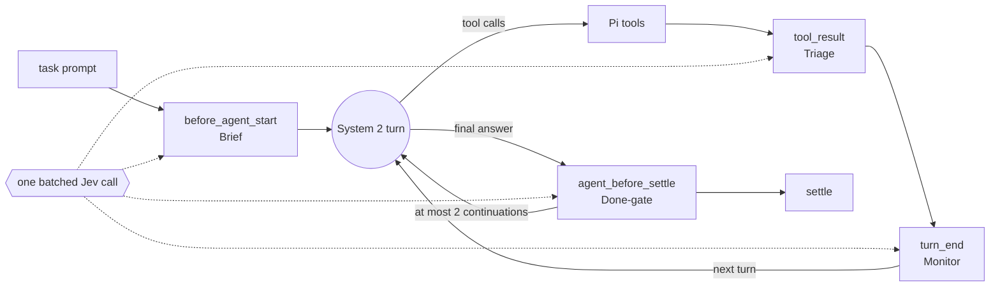

# System 1 / System 2 harness: design and evaluation plan

Proposed 2026-09-25. Story: **US-029** (proposed). Prototype:
[`pi-config/extensions/s1s2/`](../pi-config/extensions/s1s2/). The evaluation
harness is **not built**; the plan below is the review gate before it is.

This replaces the earlier 2026-09-25 recommendation (make Opus the OMP default,
shadow Jev dispatch routing). The operator rejected it as baseline hygiene plus a
different question. This document answers the actual question: design a System
1 / System 2 harness from first principles on raw Pi, prototype it, and measure
it head to head against OMP.

## The claim

An LLM loses at StarCraft because it is too slow to control every unit. A coding
agent loses in the same way: the frontier model makes every micro-decision on its own
slow clock. Each turn replays the whole context. In our five recorded OMP
sessions, cache reads were **77%** of recorded cost, and the median root session
ran **212** parent turns ([token efficiency](token-efficiency.md)). Cost and
wall-clock both scale with *turns × context*. Most of those turns are micro-decisions: which file to open next,
which output lines matter, whether a check is needed, whether the run is
circling, whether it is really done.

**Design.** System 2, the frontier model, keeps every open-ended act: planning,
writing code, and judgment. System 1 is deterministic code plus batched Jev
judgments. It runs on every event of the Pi loop and owns *attention and
reflexes*:

- it decides what enters System 2's context
- it runs routine micro-actions without spending a System 2 turn
- it interrupts only when it is confident that something is wrong

System 1 never generates text and never vetoes an action. When it is unsure, it
does nothing, so the harness degrades to raw Pi.

| StarCraft | This harness |
|---|---|
| Commander: strategy, production, when to engage | System 2: plan, write code, decide |
| Unit micro: target selection, focus fire, retreat thresholds | System 1: what to read, which output lines to keep, which check to run |
| Minimap alerts | System 1 monitor: loops, drift, unverified or unfinished work |
| APM | A System 1 decision costs about 1/150 of a System 2 turn and runs 15–100× faster |

## Economics: why it can win

Here is one System 2 decision in the middle of a task, using Claude Opus 5.5
through OpenRouter at $4/M input, $20/M output, $0.20/M cache read, and $5/M
cache write. A turn with 60k cached context, 2k new input, and 1.5k output costs
about **$0.05** and takes 5–30 s. A Jev batch prices input at $0.042/M tokens,
and output is free. With about 8k tokens of state, a batch costs about
**$0.0003** and takes about 0.3 s. Nopalito measured one call at 0.281 s and
$0.0000225. TypeSafe's cookbook shows a 13-question batch at the same latency as
one question. System 1 can therefore afford dozens of judgments for each System 2
turn. It pays off only through three levers:

1. **Fewer System 2 turns.** A briefing that names the right files lets System
   2's first turn issue parallel reads. It replaces 3–6 exploration turns.
2. **Cheaper System 2 turns.** Triage keeps a 400-line test log out of context,
   so later turns do not pay to replay it.
3. **Fewer wasted runs.** A done-gate runs the check System 2 skipped. A monitor
   catches loops.

The same levers can backfire:

- a briefing can anchor System 2 on the wrong files
- triage can drop a line that System 2 needed
- notes can distract
- System 1 latency sits on the critical path

The evaluation measures each of these failures. System 1 cannot fix a wrong
plan; that remains System 2's job.

## Invariants

1. **System 1 selects; it never generates.** Code builds candidates such as
   files, output chunks, commands, and fixed notes. Jev scores or selects them,
   and code acts. Jev never writes code, plans, summaries, or prompts.
2. **Confidence acts; uncertainty escalates.** System 1 acts automatically only
   above a threshold and only through additive or reversible actions: adding
   context, eliding output while saving it in full, or running a check. Below
   the threshold it abstains, and System 2 decides as it would in raw Pi.
3. **Fail open.** A missing key, timeout, quota error, malformed answer, or
   exception leaves raw Pi behavior unchanged.
4. **No veto.** System 1 never blocks or rewrites a System 2 tool call and never
   sits on a permission path.
5. **Interrupts are rare and fixed.** Notes come from a fixed repertoire. They
   are rate-limited and bounded per prompt.
6. **One generative model.** Every generated token comes from System 2. Jev
   returns only typed probabilities.
7. **Every decision is attributable.** Each Jev call is logged with its battery,
   answers, confidence, latency, token usage, and resulting action. The log
   names targets only by repository file paths and repository-declared check
   commands. It never contains prompt, transcript, or tool-output text, and
   never credentials. Every state sent to Jev is credential-masked first. This
   is a proposal for the operator's review. If the stricter rule is preferred,
   targets can be logged as hashes and joined offline against the reference
   diffs.

## Architecture on raw Pi

Raw Pi is the stock `pi` 0.87.1 loop with its default `read`, `bash`, `edit`, and
`write` tools. The run loads no operator extensions, skills, prompt templates,
or global guidance. The repository's own `AGENTS.md` still loads, just as it
does for OMP. System 1 is one Pi extension that attaches to four loop
boundaries:

| Battery | Pi boundary | Deterministic sensor | Jev judgment | Action when confident | When unsure or failing |
|---|---|---|---|---|---|
| **Brief** | `before_agent_start` | Extracts identifiers, paths, and quoted terms from the prompt; finds up to 30 candidate files with `git ls-files` and `rg`, plus the matching lines | Noul for each file: must it be read or edited? Score: change scope | One advisory message: up to 8 files with their matching lines, plus the safe check commands found in the repository | No briefing |
| **Triage** | `tool_result` (`bash`, more than 8 KB and 120 lines) | Always keeps the head, the tail, and error or failure lines with context; splits the rest into chunks | Noul for each chunk: does System 2 need it for its current step? | Replaces the result with the kept lines and elision markers; saves the full output to a named file | Result unchanged |
| **Monitor** | `turn_end` | Action ledger: repeated identical calls, error streaks, turns without edits | Noul: stuck? Noul: off task? Choice: which fixed note helps? | One fixed note; at most one per 4 turns and 3 per prompt | No note |
| **Done-gate** | `agent_before_settle` | `git status`; whether a check passed on the current diff fingerprint; safe check candidates (test/check/lint/verify only, never `--fix`/deploy/publish) | Choice: which candidate verifies this change, or none? Choice: complete, unfinished, or blocked? | System 1 runs the chosen check. A failure yields one continuation with triaged evidence. Unfinished work yields one fixed nudge | Settle as raw Pi |

**System 2 contract.** The system prompt gains one section of about 80 tokens. It
tells System 2 that `S1:` notes, briefings, and elisions are advisory evidence,
that full output is one read away, and that System 2 decides. The section is
static, so the prompt cache stays warm.

**Outside the v0 scope.** Each item below is a later increment that would be
measured by ablation:

- `locate(intent)` and `check()` orders. System 2 would issue them; System 1
  would run search, ranking, and verification.
- Retroactive `context_edit` of stale outputs. It forces a cache rewrite, so it
  is worthwhile only above a context threshold.
- Anticipatory prefetch after edits.
- Adaptive System 2 effort. It is excluded from the evaluation because it breaks
  the same-settings rule.

## Prototype v0

Package: [`pi-config/extensions/s1s2/`](../pi-config/extensions/s1s2/)

| File | Contents |
|---|---|
| `index.ts` | Hooks, ledger, and decision log |
| `questions.ts` | Every Jev question, with its thresholds beside it |
| `sensors.ts` | Deterministic candidate, chunking, check-discovery, and fingerprint code |
| `run.sh` | Headless single-task launcher |
| `s1s2.test.ts` | US-029 contracts: fail-open, inert mode, triage and check safety, verification and edit detection, credential masking, and bounded authority |

Jev calls go through the existing shared engine: `OpenRouterJevProvider`, pinned to
`typesafe/jev-1.13`. Its credential comes from Pi's OpenRouter auth or from
`OPENROUTER_API_KEY`. Every state passes through the shared `redactText` before it
is sent. The engine now also returns the token usage and cost that the provider
reports, which it previously dropped, so System 1 cost is measured rather than
estimated. Edits are detected from the working-tree fingerprint, not from tool
names, because models often patch files through `bash`. The package is not
deployed to the daily Pi profile. It runs only through `run.sh` or an explicit
`pi --no-extensions -e …`. `S1S2_MODE=off` loads the extension inert.

Smoke evidence from the real task end to end on exe.dev:
[s1s2-smoke-2026-09-25.md](measurements/s1s2-smoke-2026-09-25.md).

## Evaluation plan

### Question and hypotheses

These are registered before the main run.

- **Primary question.** With the same frontier model and settings, does System
  1 / System 2 reach at least OMP's quality at lower total cost or wall-clock?
- **H1, cost.** Provider-billed cost per task is lower.
- **H2, time.** Wall-clock per task is lower.
- **H3, quality.** Quality is non-inferior.
- **Secondary.** Isolate the System 1 effect (B vs C) from the base-harness
  effect (C vs A), and attribute each battery's decisions to outcomes.

### Arms

| Arm | Harness | Notes |
|---|---|---|
| **A: OMP** | OMP 18.3.1 as deployed. `omp-config` at the candidate revision is installed into an isolated HOME on the VM | Every generative role is pinned to M@T: all 12 `modelRoles`, including advisor, task, smol, commit, and reviewers, plus all `agentModelOverrides`. `retry.fallbackChains` are removed. The advisor stays on because it is part of OMP's design, but it runs on M@T. There is no Linear, pass, or telemetry. |
| **B: S1S2** | Raw Pi 0.87.1 plus `s1s2` v0 at a pinned commit | Uses M@T. Jev is the treatment. |
| **C: raw Pi** (recommended) | Stock Pi 0.87.1 | Uses M@T. It separates System 1's contribution from the base-harness difference, at 50% more run cost. |

### Same model, same settings, same route

**M@T** is Claude Opus 5.5 at medium thinking, the operator's stated daily
preference, served as `anthropic/claude-opus-5.5` through OpenRouter. This is
the only route both harnesses can share:

- Pi has no Anthropic login.
- US-014 forbids copying OAuth credentials between harnesses.
- exe.dev's managed LLM credit has $4.95 left.

Before the main run, a **wire-parity preflight** captures the first provider
request in each arm through `before_provider_request`. The model id, reasoning
parameters, and prompt-caching markers must be identical. Pi already sends
Anthropic `cache_control` on OpenRouter `anthropic/*` routes. A mismatch is
fixed in configuration, never waved through.

There is no provider fallback in any arm. A provider failure is an
infrastructure failure: the run repeats, at most twice, and never switches
models. The key is a dedicated evaluation key with a hard limit, held off the VMs
by an exe.dev `http-proxy` integration.

### Tasks

- **Count.** 48 tasks: 16 S, 16 M, and 16 L. They come from at least six
  repositories: cantrip, scry, landmark, linejam, chrondle, and harness. A pool of
  45 merged pull requests plus harness candidates has already been identified.
- **Replay.** Each task replays a merged pull request at its base commit.
- **Statement.** Use the linked issue text. When there is none, a curator who
  is not a judge restates the problem at the behavior level, and the statement
  is checked for solution leakage.
- **Prompt.** Every arm receives the same statement inside the same autonomy
  wrapper: work without questions; leave changes in the working tree; do not
  commit, push, or open pull requests; finish with a summary of what changed and
  how it was verified.
- **Acceptance.**
  - The pull request's test changes are withheld and applied after the run as
    hidden tests.
  - The repository's existing suite must still pass.
  - A curator screens every hidden assertion. Assertions that bind to
    something the statement does not specify, such as a private helper's
    signature or exact output bytes, are either relaxed to the behavior or
    named in the statement. The smoke task's only hidden-test failure was
    exactly this: byte equality with `git log -p`.
  - Tasks without automatable tests are judged only and reported separately.
- **Exclusions.** Tasks that need secrets, live services, a GUI or browser, or a
  build longer than 15 minutes on the evaluation VM.
- **Pilot first.** Run 6 tasks (2 per stratum) in all 3 arms. The pilot proves
  the pipeline and the parity preflight, and it measures per-run cost and
  variance so that N is fixed on evidence.

### Execution

- **Where it runs.**
  - Each run uses a fresh checkout on exe.dev with an identical image.
  - Toolchains and dependencies are installed before the clock starts.
- **Order and limits.**
  - Arms are interleaved in a randomized order for each task.
  - At most 4 runs happen at once. The Medium plan pools 4 vCPU and 16 GB across
    11 existing VMs.
  - Each run has a 40-minute timeout and a per-run spend cap.
- **Isolation.** Evaluation VMs get their own tag with read-only GitHub
  integrations, so nothing can be pushed. They have no Linear access, no pass,
  and no telemetry. Hidden tests and reference diffs never enter the VM before
  the agent exits.
- **Replicates.** Each task-arm runs once. A stratified subset of 16 tasks gets a
  second replicate to measure run-to-run noise.
- **Runner mechanics.** These were learned from the smoke run. Every run writes
  a completion marker (`run.json`), and orchestration waits on that marker,
  never on process-name matching: a `pgrep -f` loop matched its own command
  line and hung. The launcher reads the key from stdin and backgrounds only the
  run, never a `read … && … &` chain, whose `read` gets `/dev/null`.

### Measurements

| Metric | Definition and source |
|---|---|
| Tokens | Uncached input, output including reasoning, cache read, and cache write. Split by source: System 2 main, OMP advisor and subagents, and Jev. Sources are session JSONL plus sidecars and the System 1 decision log. `omp-task-usage` (US-018) will be extended for Pi `usage` entries and Jev records. |
| Cost | Provider-billed USD, reconciled against the key's usage. Failed runs count. Cost per successful task follows US-018. |
| Wall-clock | Runner launch to exit. Also recorded: System 2 turns, tool calls, and System 1 seconds on the critical path. |
| Quality: objective | Hidden tests pass (primary), the existing suite passes, and the build and lint pass. |
| Quality: judged | Blind LLM panel plus a Jev panel (below). |

### Blind judging

- **Inputs.** Judges see:
  - the statement
  - the base-commit versions of the touched files
  - one accepted reference diff, labeled as one acceptable solution
  - anonymized candidate diffs

  They never see transcripts, harness names, commit messages, timings, or test
  results.
- **Normalization.** Harness artifacts (session directories, `.pi`, `.omp`) are
  removed, and files appear in a fixed path order.
- **LLM panel.**
  - Three families, none of them the System 2 model: GPT-6 Sol, Gemini 3.1 Pro,
    and Grok 4.7.
  - Fixed rubric with anchored 1–5 levels: task success, correctness risk,
    scope discipline, maintainability, and verification.
  - A pairwise question, "Which would you merge?", with answers A, B, or
    neither. Each pair is judged in both orders.
- **Jev panel.** The same rubric as Score and Choice questions, with 5
  paraphrase and order variants per item. It is cheap enough to run on
  everything.
- **Validity.**
  - Agreement between judges (Krippendorff's α).
  - Agreement between judges and hidden tests.
  - Phaedrus blind spot-checks 10 randomly drawn pairs.

### Analysis and decision rule

- **Unit of analysis.** The task.
- **Cost and time.** Geometric-mean ratio B/A with a 95% bootstrap confidence
  interval that resamples tasks, plus a Wilcoxon signed-rank test.
- **Quality.** The paired hidden-test pass difference with an exact confidence
  interval, and the judged win rate with its confidence interval.
- **Win, loss, or inconclusive.**
  - B wins if quality is non-inferior and the confidence interval for the cost
    or time ratio lies below 1.0. Non-inferior means the pass rate is at most 5
    points lower and the judged win rate is at least 45%.
  - B loses if quality is inferior.
  - Any other result is inconclusive.
- **Power.** Assume 48 paired tasks and a log-ratio standard deviation of 0.7;
  the pilot will measure the real value. Under that assumption, a cost or time
  difference of about 25% is detectable at 80% power. Quality is framed as
  non-inferiority, because 48 tasks cannot resolve a pass-rate gap of a few
  points.
- **Reporting.**
  - Results for each stratum.
  - B vs C and C vs A.
  - System 1 attribution: which batteries fired, what they changed, and what
    happened next.
- **Registration.** The analysis plan is committed before the main run.
  Exclusions and reruns are logged.

### Budget and schedule

- **Evidence so far.** The medium-sized smoke task cost $0.25–0.28 of Opus per
  System 1 / System 2 run and took 90–97 s ([smoke](measurements/s1s2-smoke-2026-09-25.md)).
- **Assumptions.** These are for the pilot to re-measure.
  - A Pi-family run costs about $0.15 (small), $0.30 (medium), or $1.50
    (large).
  - An OMP run costs about 2.5× as much, because of its heavier fixed prompt
    and its pinned advisor on every turn.
- **Model spend.** About **$250**:
  - 48 tasks × 3 arms: about $140.
  - 16 replicates: about $45.
  - Pilot: about $20.
  - Judges: about $30.
  - Jev: under $1.
- **Limit.** A hard key limit of $600, which covers large tasks running
  several times over estimate.
- **Compute.** About 210 runs, typically a few minutes each plus dependency
  installs. That is roughly 6–8 hours at 4-way concurrency on the current plan.
  Tasks with heavy Rust builds may need a temporary Large tier (+$40/month).
- **Bandwidth.** 170 of 200 GB of transfer is already used this cycle; the
  counter resets on October 10. Transfer for the evaluation is estimated at a
  few GB.

### Decisions needed before the evaluation harness is built

1. **Route and budget.**
   - *Recommended.* A dedicated OpenRouter key with a $600 limit, held in an
     exe.dev integration.
   - *Alternative.* Pass the key to each run on stdin: it avoids an account
     change but keeps the key in VM memory.
2. **Arm C.**
   - *Recommended.* Include it. Without it, a win or loss cannot be attributed
     to System 1.
3. **OMP advisor.**
   - *Recommended.* Keep it on M@T; it is OMP's own design.
   - *Alternative.* Turn it off. That is cheaper but tests less than OMP.
4. **M@T.**
   - *Recommended.* Opus 5.5 at medium.
   - *Alternative.* A higher level, which multiplies the budget.
5. **N.**
   - *Recommended.* 48 tasks plus 16 replicates, confirmed by the pilot's
     variance.

## Threats to validity

- **Base-harness confound.** Pi and OMP differ in tools, prompts, and editing.
  Arm C measures that difference directly.
- **Hidden tests that are too narrow.** The screen above addresses this, and
  judges and tests are compared against each other.
- **Judge bias.** Mitigated by blinding, both pair orders, three model families,
  a Jev cross-check, and a human spot-check.
- **Provider drift during the run.** Mitigated by interleaved arms and a fixed
  route; the upstream provider is recorded for each call.
- **Threshold overfitting.** System 1 thresholds are frozen after the pilot and
  never tuned on main-run tasks.
- **Contamination.** Tasks are merged pull requests, so the model may have seen
  the code. Both arms share this bias, but it can compress the differences
  between them.
